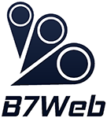

  
   
  <h1>🚀 MediCenter - #B7Web 🚀</h1>

## 📚 Sobre

Página inicial de um website reponsivo e acessível para uma clínica médica fictícia.

## 🏗️ Desenvolvimento

Desenvolvido durante o curso de [HTML5 e CSS3](https://alunos.b7web.com.br/curso/html5-e-css3/projeto-site-com-flexbox-e-html-semantico-parte-1) do professor [Bonieky Lacerda](https://www.instagram.com/bonieky/), CEO da [B7Web](https://b7web.com.br/fullstack/).

## 📝 Notas

O desenvolvimento foi concluído em Dezembro de 2021, porém, em agosto de 2022 recebeu uma repaginada por mim, desta vez se utilizando de tecnologias mais modernas, como: ReactJS, NextJS, TypeScript e SASS.

## 🔎 Demonstração

  

## 💻 Como acessar

<!-- Onde a sua aplicação está hospedada? -->

## 🛠️ Tecnologias utilizadas

 

<table align="center">
  <tbody>
    <tr>
      <td align="center" width="110" height="110">
        
         
        HTML
      </td>
      <td align="center" width="110" height="110">
        
         
        CSS
      </td>
      <td align="center" width="110" height="110">
        
         
        JavaScript
      </td>
      <td align="center" width="110" height="110">
        
         
        React
      </td>
    </tr>
    <tr>
      <td align="center" width="110" height="110">
        
         
        Markdown
      </td>
      <td align="center" width="110" height="110">
        
         
        SASS
      </td>
      <td align="center" width="110" height="110">
        
         
        TypeScript
      </td>
      <td align="center" width="110" height="110">
        
         
        Next
      </td>
    </tr>
    <tr>
      <td align="center" width="110" height="110"></td>
      <td align="center" width="110" height="110">
        
         
        Jest
      </td>
      <td align="center" width="110" height="110">
        
         
        NodeJS
      </td>
      <td align="center" width="110" height="110"></td>
    </tr>
  </tbody>
</table>

 

✨ Made with 💙 by <a href="https://github.com/riandeoliveira"><strong>Rian Oliveira</strong></a> ✨

