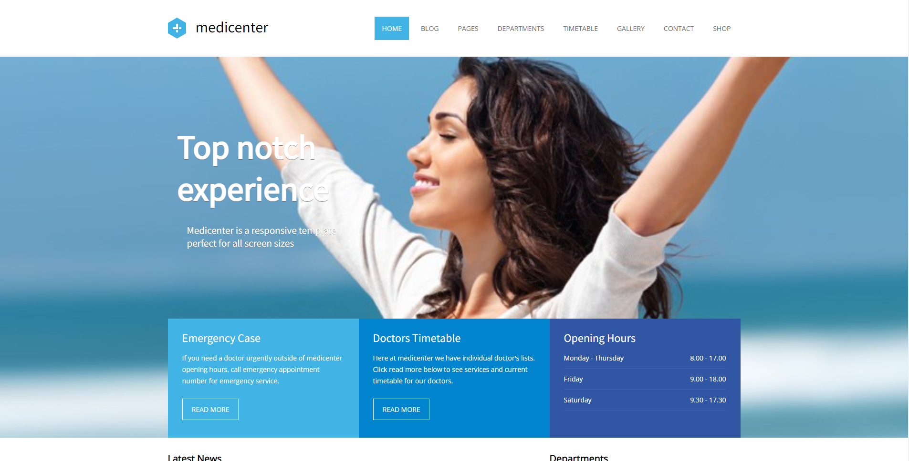

<h1 align="center">MediCenter</h1>

## Sobre o Projeto

Site responsivo que fiz durante o curso de <a href="https://alunos.b7web.com.br/curso/html5-e-css3/projeto-site-com-flexbox-e-html-semantico-parte-1">HTML5 e CSS3</a> com <a href="https://www.linkedin.com/in/bonieky/detail/recent-activity/posts/">Bonieky Lacerda</a>, CEO da B7Web. O layout não é de minha autoria, apenas o desenvolvi usando uma base já existente <a href="https://preview.themeforest.net/item/medicenter-responsive-medical-wordpress-theme/full_screen_preview/4718613?_ga=2.78547284.1904183569.1638537014-1685083464.1638537014">aqui</a>.

## Layout

</img>

## Tecnologias utilizadas

### Front-end (apenas)

</img>
 
</img>
 
</img>

## Pré-requisitos

* Navegador (ex: [Google Chrome](https://www.google.com/intl/pt-BR/chrome/))

## Desenvolvido em

6 de dez. de 2021

<strong>Novas features em Breve!<strong>

Made with 💙 by Rian Dias de Oliveira
